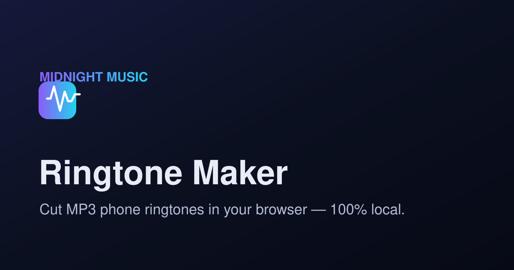

# 🎵 Ringtone Maker

A browser-based **MP3 cutter for making phone ringtones**. Upload a song, slice it into
perfect clips on an interactive waveform, add fades, and download crisp **320 kbps** MP3s.

**Everything runs locally in your browser — your audio is never uploaded to any server.**



---

## Features

### Cutter (`/`)
- **Load audio** by drag-&-drop, file picker, or **direct audio URL** (`.mp3`, `.m4a`, `.aac`, `.wav`, `.ogg`, `.flac`).
  - Streaming/download pages (YouTube, Spotify, SoundCloud…) are rejected with an explanation.
  - CORS-blocked or private links show a clear copyright + CORS message.
- **Waveform** with draggable, resizable colored regions (wavesurfer.js).
- **Auto-split** into 2–200 equal parts with one click (slider **and** number input). Each cut is capped at **30 s** (standard ringtone length).
- **Manual cutting** — add segments by hand and drag the region to set start/end (max 30 s each).
- Per-segment: **rename**, **fade in / fade out** (0.5 s), **preview** (plays just that region), **try as ringtone**, and **delete**.
- **Download** each segment as a **320 kbps** MP3, or **Download all** as a ZIP.

### Preview (`/preview`)
- Upload a ringtone (or receive one handed over from the cutter).
- Play / **loop**, **volume** slider, and an optional **gain boost** (+2.5× via Web Audio).
- **Mock incoming-call phone UI** with animated ringing avatar.
- **Download** button.

### Set up (`/setup`)
- Step-by-step guide to set the ringtone as your default, with **Android** and **iPhone** tabs.
  - Android: Files app → Ringtones folder → Sound settings.
  - iPhone: GarageBand import → export as Ringtone → Settings.
- **Troubleshooting** notes per platform.

### Design
- **"Midnight Music"** dark theme — navy studio background, violet primary + cyan secondary accents.
- Fully **mobile-friendly**: compact top bar collapses to icon-only buttons, stacked rows, no horizontal overflow.
- **Semantic design tokens** via CSS variables (`src/styles/tokens.css`) — no hardcoded colors in components.
- **SEO**: every page sets its own title, description, and OG/Twitter meta at runtime.

---

## Running it

No build step. Any static server works:

```bash
# built-in zero-dependency server (Node 18+)
npm start            # → http://localhost:3000
# or choose a port
node serve.js 8080
```

Then open the URL in a modern browser.

> You can also drop these files on any static host (Netlify, GitHub Pages, S3, nginx…).
> For client-side routes (`/preview`, `/setup`) to work on hard refresh, configure the host to
> fall back to `index.html` (the included `serve.js` already does this).

---

## Architecture & tech notes

The app is written in **React 19** with a tiny file-based-style router (`/`, `/preview`, `/setup`),
using [`htm`](https://github.com/developit/htm) tagged templates so it runs **with no build/transpile step**.

Runtime libraries are resolved by the browser via a native **import map** in `index.html`:

| Library | Role |
| --- | --- |
| `react` / `react-dom` 19 | UI |
| `wavesurfer.js` 7 + regions plugin | waveform + draggable regions |
| `@breezystack/lamejs` | 320 kbps MP3 encoding |
| `jszip` | "Download all" ZIP |
| `htm` | JSX-free templating |

All decoding uses the **Web Audio API** (`decodeAudioData`); slicing, fades, and encoding happen
entirely on the client. **Nothing is uploaded.**

### Why an import map instead of TanStack Start / Vite / Tailwind?
This project was built in a sandbox with **no access to the npm registry** (an `INTEGRATIONS_ONLY`
network where `registry.npmjs.org` and CDNs are blocked for the build environment), so a
`npm install` / Vite build of a TanStack Start app was not possible there. The app therefore ships
as a **no-build React 19 app** that loads its dependencies from a CDN in *your* browser (which has
normal internet). The route structure (`/`, `/preview`, `/setup`), component model, semantic
design tokens, mobile-first layout, and per-page SEO are all exactly as specified — only the build
tooling differs.

### Project layout
```
ringtone-maker/
├── index.html              # import map + base SEO
├── serve.js                # zero-dep static server w/ SPA fallback
├── favicon.svg · og.svg
└── src/
    ├── main.js             # React root
    ├── App.js              # shell + router outlet
    ├── lib/
    │   ├── audio.js        # decode / slice / fade / MP3 encode (lamejs)
    │   ├── router.js       # minimal history router
    │   ├── seo.js          # per-page meta
    │   └── store.js        # toasts + cutter→preview handoff
    ├── components/
    │   ├── TopBar.js · Footer.js · Toaster.js
    │   ├── Waveform.js     # wavesurfer + regions wrapper
    │   └── icons.js
    ├── pages/
    │   ├── CutterPage.js · PreviewPage.js · SetupPage.js
    └── styles/
        ├── tokens.css      # semantic design tokens
        └── app.css
```

## License / usage
Only cut and use audio you own or are licensed to use.
